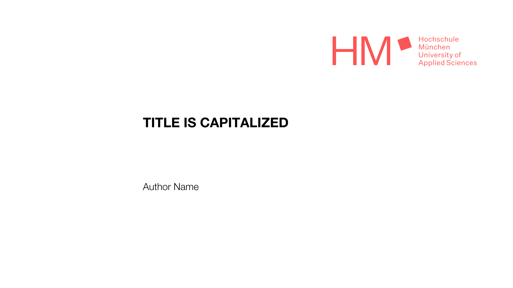
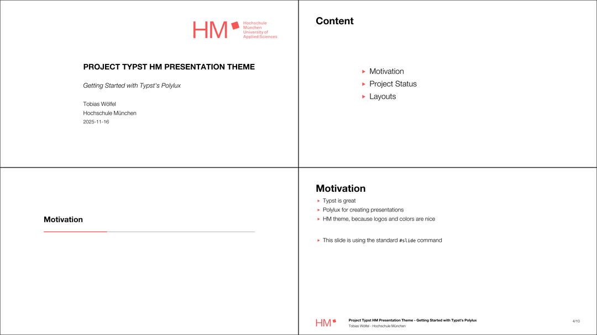

# HM Slide Theme

A template theme for [HM](https://www.hm.edu) presentations for use with
[Polylux](https://github.com/polylux-typ/polylux/).

*Note: The theme is in an alpha state, it has not yet been widely tested for
presentations. It has also not yet been submitted as a package to
[Typst Universe](https://typst.app/universe/), so it is a bit harder to get
started. Feedback is welcome!*



## Example

Some features of the theme can be seen in the example
[feature-overview](./examples/feature-overview.pdf).



## Usage

To get started use either `typst init @preview/hm-polylux` or add the following
to the document.

```typst
#import "@preview/polylux:0.4.0": *
#import "@local/hm-polylux:0.1.0" as hm: *

#show: hm.setup.with(
  title: "Project Typst HM Presentation Theme",
  author: "Some Name",
)
```

### Dependencies

The main font is _Helvetica Neue_. The fallback font is _Nimbus Sans_.

### Layouts

The HM theme comes with a few predefined layouts:

- `slide-vertical`: Content positions left and vertically in the middle
- `slide-centered`: Content positioned in the center
- `slide-split-2`: Two columns, with content starting at the top
- `slide-split-1-2`: Two columns, 1/3 and 2/3 of page width

To create your own custom slides use the standard `#slide[]` function.

### Presentation Support

The theme comes with a few special functions:

- `title-slide` creates the title slide
- `new-section` creates a section slide with a progress bar
- `new-section-orientation` creates a section slide with list of sections
- `slide-toc` creates the table of content slide
- `bmftr-note` adds a BMFTR funding note
